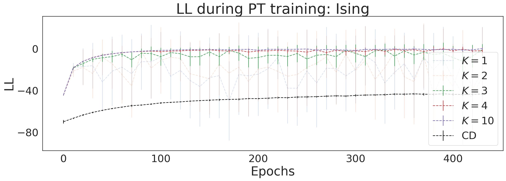

# Training RBMs with Parallel Tempering

This repository contains the code to train restricted Boltzmann machines (RBMs) on data generated from Ising models. The Ising data is generated using Magneto (https://github.com/s9w/magneto). The RBM model implementation is based on that used by the authors of (https://arxiv.org/abs/1810.11503). I implemented (persistent) contrastive divergence, or parallel tempering in PyTorch, based on the PyDeep implementation of RBM samplers (https://pydeep.readthedocs.io/en/latest/_modules/pydeep/rbm/sampler.html). I generated 25k samples from an $8 \times 8$ Ising model, at a temperature of $T=1.8$, with toroidal boundary conditions using Magneto:

```
./magneto/magneto.exe -L=8 -TMin=1.8 -TMax=1.8 -TSteps=1 -N1=10000 -N2=25000 -N3=100 -states=testStates -record=main
```

I then trained 10 RBMs on this data (all with 64 visible and hidden nodes), using either standard contrastive divergence, or parallel tempering with $K$ parallel chains. The mean and standard deviation across these 10 machines, along the first 500 training epochs, are shown here (plot taken from the notebook in this repo):



It can be seen that switching to PCD (i.e. K=1) already improved the convergence, but gradients were noisy. Increasing $K$ made the convergence even faster, and more stable. More information on these training schemes, and where this improvement comes from, is printed below. 

## Contrastive divergence
RBMs are traditionally trained with contrastive divergence, where the gradients are based on how training examples are propagated through the hidden layer. Contrastive divergence training suffers from the fact that the Markov chains converge to the true distribution more slowly as the network weights grow, making training unstable (Fischer, 2010). To stabilise training, I explored a technique called parallel tempering. One problem with contrastive divergence is that the gradients are only calculated closely around training examples. To get around this, one could increase $k_{CD}$, but doing so quickly becomes computationally expensive. Another solution, referred to as persistent contrastive divergence (PCD), is to first initialise the Markov chain with a random state, but afterwards use the sample that resulted from $k_{CD}$ Gibbs samplings to initialise the next chain. Like this, the gradients can be estimated in a less restricted part of sample space. However, since the network weights change at each PCD iteration, the Markov chain is never actually initialised with a sample from the model distribution. To mitigate this effect, PCD requires a smaller learning rate (Fischer, 2010). However, PCD still suffers from emphasising areas of model space where the chain is currently running. This problem is addressed by sampling the state space using a technique called Parallel Tempering.


## Parallel Tempering
Parallel tempering is a technique designed to explore a larger area of the model space of the RBM. It does so by running multiple Markov chains at the same time, all running at different temperatures. The distribution over an RBM

$$
p(v, h|\theta) = \frac{1}{\mathcal{Z}({\theta})}e^{E(v, h |{\theta})}
$$

is a Boltzmann weight at unit temperature. Consider a family of $K$ distributions, indexed by inverse temperatures $\beta_k = \frac{1}{T_k}, ~ k \in [1, ..., K]$:

$$
p_k(v, h|\theta) = \frac{1}{\mathcal{Z}_k({\theta})}e^{\beta_k E({v}, {h} |{\theta})}
$$

Note that $\beta=0$ corresponds to infinite temperature: a uniform distribution. Any set $\{\beta_k\}$ with $\beta$s between 0 and 1 interpolates between the original RBM distribution $p_{k=1}(v, h|\theta)$ and the uniform distribution $p_{k=0}(v, h|\theta)$. Parallel tempering then starts $K$ parallel Markov chains, all at different temperatures. Only the $\beta=1$ chain still corresponds to the original distribution, while the chains with lower $\beta$ (higher temperature) explore the RBM's state space more uniformly. The question is how to use this information to inform the chain running at $\beta=1$. The parallel tempering algorithm lets the $K$ chains run independently for several steps, and then swaps the state of the two neighbouring chains running at temperature $\beta_k$ and $\beta_{k+1}$ with a probability given by a metropolis factor:

$$
    P(\text{swap}) = \min \Big\{ 1, ~ \exp\Big((\beta_k - \beta_{k+1})\left(E(v_k, h_k| \theta) - E(v_{k+1}, h_{k+1}| \theta)\right)\Big) \Big\}
$$

where $v_k, h_k$ are the states from a chain running at temperature $\beta_k$. Then, like with PCD, after each iteration the final state for \textit{each} of the $K$ chains is used as the input to the next iteration. Parallel tempering is thus the same as running $K$ PCD chains. To calculate expectation values, only states from the $\beta=1$ chain are used, the difference with PCD being that this chain is now enriched with states that were sampled from more uniform distributions but still had a high probability under the $\beta=1$ distribution. The only thing left to specify is how to do the state-swapping as the order in which the chains are compared might change results. Throughout this chapter, I followed the literature (Desjardins, 2010) and used the Deterministic Even Odd (DEO) algorithm, first proposing swaps between all chains at $\beta_k$ and $\beta_{k+1}$ for even $k$, and then starting again at odd $k$. 